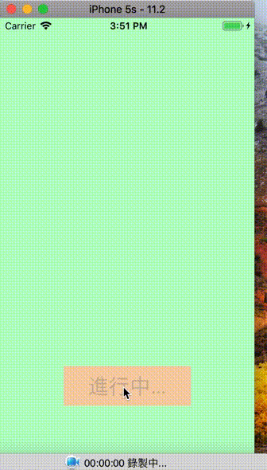
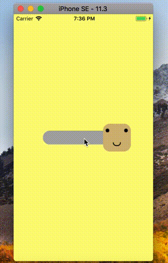
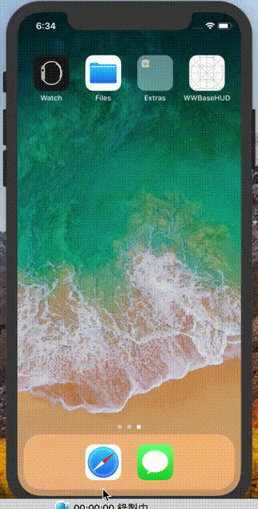
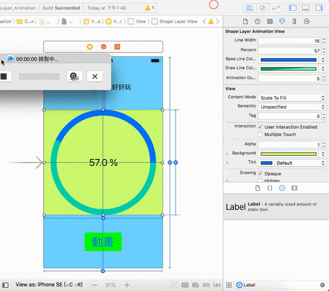

# Swift 4 - 小小心得

## LayerAnimation - 利用遮罩做動畫

## SafeArea_iOS11 - 利用Autolayout處理SafeArea

## WWSwitch - 利用UIView仿製一個網路上看到的Switch

## WWBaseHUD - 利用UIWindow仿製一個HUD

## CAShapeLayer_Animation - 簡單的動畫加上IBDesignable
