# Swift 4 - 小小心得

## LayerAnimation - 利用遮罩做動畫

## SafeArea_iOS11 - 利用Autolayout處理SafeArea

## WWSwitch - 利用UIView仿製一個網路上看到的Switch

## WWBaseHUD - 利用UIWindow仿製一個HUD

## CAShapeLayer_Animation - 簡單的動畫加上IBDesignable

## Unicode_Emoji - 利用Unicode組合出顏文字

## UILabel_AttributedString - 利用NSAttributed組合出中英文各一種字型

## WWPrint - 有細節提示的Print

## WWBezierTextView - 將字串轉為貝茲曲線

## WWTransitionAnimation - 簡單的轉場動畫
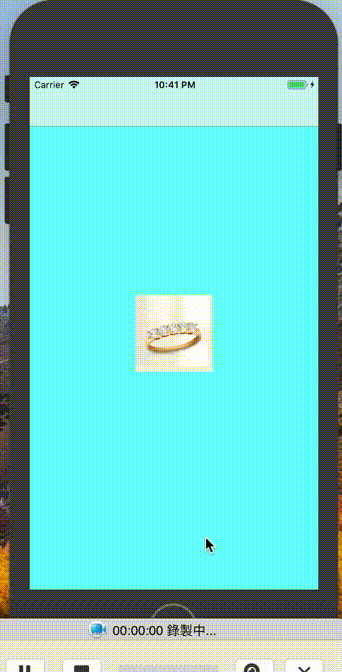

## AlamofireResumeFromBreakPoint - 利用Alamofire做圖片斷點續傳

## PushNotificationWithP8 - 利用推播換頁
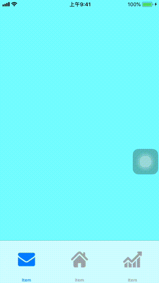

## ImageDeleteShakeAnimation - 仿iOS圖標抖動、iOS刪除App效果
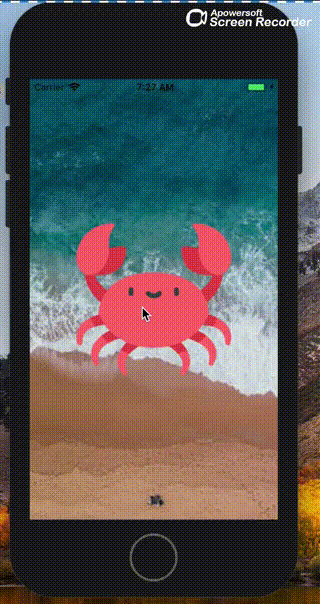

## WWSegmentControl - 自定義的SegmentControl
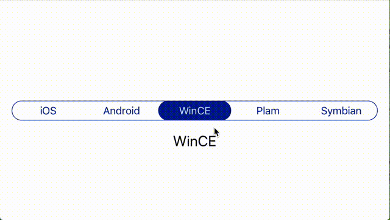

## UITabBarWithCustomButton - UITabBar加上自訂按鈕
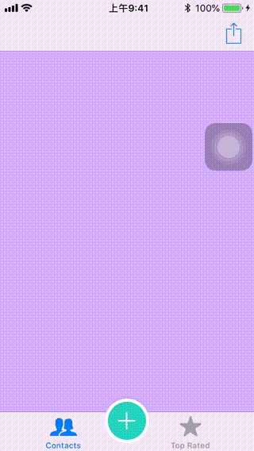

## WWCaReplicatorLayer - CAReplicatorLayer自訂Loading動畫

## VisualEffectView - 利用UIVisualEffectView做出模糊背景
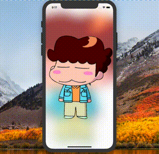

## WWTableViewPuttingCollectionView - TableView內加上CollectionView

## WWSlideMenu - 簡單的側邊選單
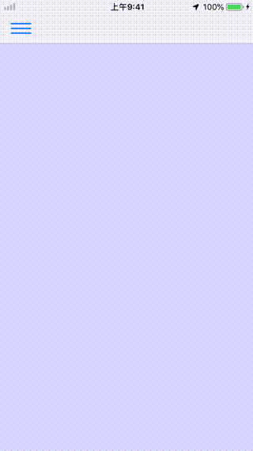

## WWContainerSideView - WWContainerView做出側邊選單
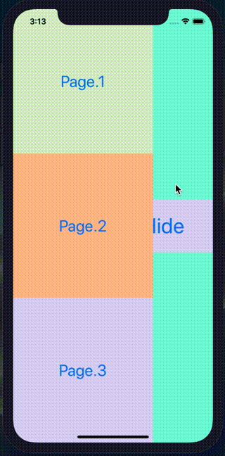

## TicTacToe - 一個簡單的井字遊戲
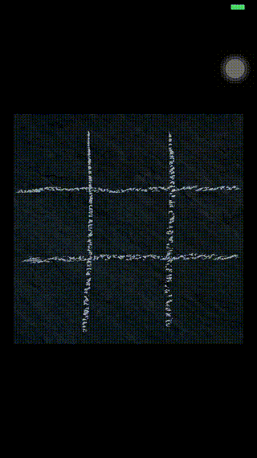

## TicTacToe_OnLine - 一個簡單的井字遊戲 (連線對戰版)
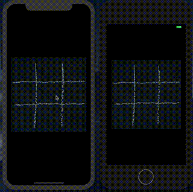

## Lottery - 抽籤的小工具
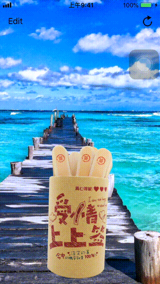

## PaintView - 簡易可連線的繪圖板
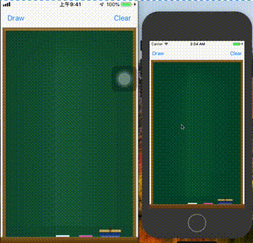

## TableViewHitTest - 利用hitTest讓TableView的背後按鍵可以被按

## HigherOrderFunction - 自定義高階函數
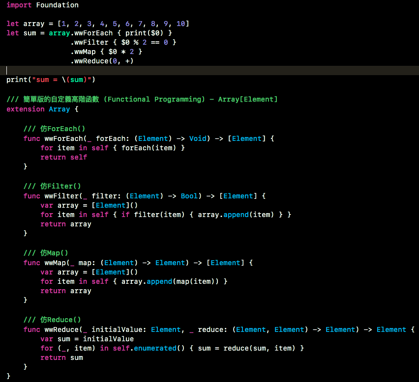

